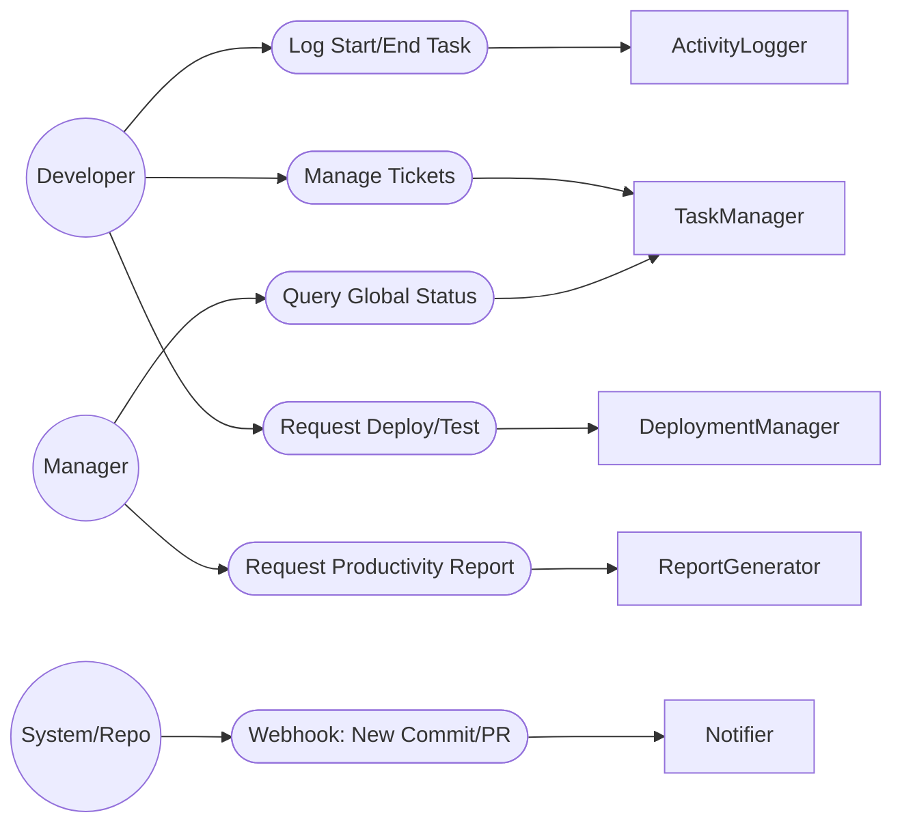
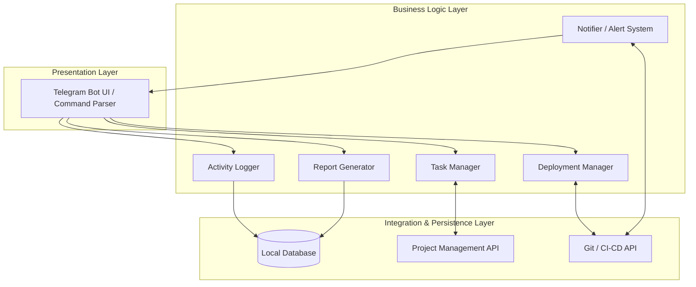

# Module 5 Design & Architecture: Oracle Java Bot
**Team:**
* Jaime Esteban Ochoa
* Daniel Wynter
* Luciano Luna
* Guillermo Baltazar

**Date:** 10 de Abril de 2026
## 1. Component Identification Process and Rationale
**Methodology used:** Actions/Actors Approach.
**Rationale:** According to the modularity principles discussed in class, the
Actions/Actors approach is highly effective when we can easily identify the actors
interacting with the application and the specific activities they perform. For the
Oracle Java Bot, the user interaction model is strictly command-driven. We have
clear actors (Developers, Managers, and the System/Repository) executing discrete
commands (Actions) via Telegram. By mapping these specific actions (e.g., logging a
task, requesting a deployment, triggering a webhook) to their respective execution
modules, we were able to define highly cohesive software components that fulfill
our Functional Requirements.
## 2. Component Identification Flow Diagram
*This diagram follows the Actions/Actors Approach, mapping the user to their
action, and the action to the responsible component.*

## 3. Component Table
| Actor | Event / Action | Component | Component Responsibilities |
| :--- | :--- | :--- | :--- |
| **Developer** | Log start and end of daily tasks | `ActivityLogger` | Parses
time-tracking commands, validates user identity, and records timestamps in the
database to track working hours. |
| **Developer** | Create, reassign, or close tickets | `TaskManager` | Communicates
with the external project management API (e.g., Jira) to update ticket status and
retrieve task details. |
| **Developer** | Request execution of tests or deployment | `DeploymentManager` |
Authenticates critical permissions, triggers CI/CD pipelines for
testing/deployment, and logs the deployment history. |
| **Manager** | Query current status of all tasks | `TaskManager` | Aggregates and
returns the real-time status of all ongoing sprint tickets. |
| **Manager** | Generate weekly productivity report | `ReportGenerator` |
Consolidates data from `ActivityLogger` and `TaskManager`, calculates the 20%
productivity metric, and formats a PDF report. |
| **System** | Trigger webhook on new Commit or PR | `Notifier` | Listens for
repository events, formats the message, and broadcasts alerts (including delay
warnings) to the Telegram channel. |
## 4. Technical Partitioning
*Technical partitioning organizes components by their technical capabilities (e.g.,
Presentation, Business Logic, Persistence). This allows us to separate the chat
interface from the core logic.*

## 5. Domain Partitioning
*Domain partitioning organizes components around business workflows and isolated
domains, inspired by Domain-Driven Design (DDD). This prepares the architecture for
a potential microservices migration.*
```mermaid
flowchart TB
subgraph InterfaceDomain [Interface Domain]
ChatInterface[Command Parser & Authentication]
end
subgraph TrackingDomain [Tracking & Management Domain]
ActivityLogger[Activity Logger]
TaskManager[Task Manager]
end
subgraph AnalyticsDomain [Analytics Domain]
ReportGenerator[Report Generator]
end
subgraph DevOpsDomain [DevOps Operations Domain]
DeploymentManager[Deployment Manager]
Notifier[Webhook Notifier]
end
%% Interactions between domains
InterfaceDomain --> TrackingDomain
InterfaceDomain --> DevOpsDomain
InterfaceDomain --> AnalyticsDomain
TrackingDomain -.-> AnalyticsDomain
`